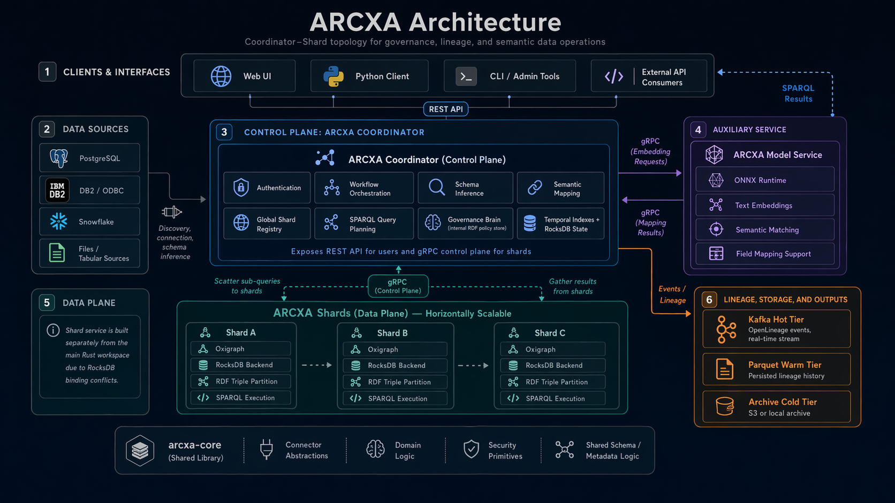

# ARCXA

<p align="center">
  <a href="https://github.com/equitusai/arcxa"></a>
  
  
  
  <a href="./LICENSE.md"></a>
</p>

<p align="center"><strong>Governed data movement, semantic mapping, lineage, and systems-of-systems validation in one platform.</strong></p>

<p align="center">
  ARCXA helps teams connect operational data sources, materialize governed datasets, orchestrate repeatable workflows,
  preserve lineage, and apply policy-driven validation without stitching together separate control planes for ingestion,
  semantics, execution, governance, and interoperability.
</p>

<p align="center">
  
</p>

> Welcome to the curated public repository. Historical internal working notes are intentionally not mirrored here. The maintained public documentation starts in `docs/README.md`.

## Table Of Contents

1. [Why ARCXA](#why-arcxa)
2. [Platform Snapshot](#platform-snapshot)
3. [How To Read This Repository](#how-to-read-this-repository)
4. [Architecture At A Glance](#architecture-at-a-glance)
5. [Naming Note](#naming-note)
6. [Quick Start](#quick-start)
7. [Documentation](#documentation)
8. [Repository Map](#repository-map)
9. [License](#license)

## Why ARCXA

Many platforms can move data. Fewer can show, with confidence, what changed, why it changed, which workflow touched it, which ontology terms were applied, which policies were active, and what downstream systems are now depending on the result.

ARCXA is built for that broader problem.

It combines:
- datasource onboarding and connector capability reporting
- managed datasets, catalogue views, and entities
- ontology-aware semantic mapping and unified multi-source normalization
- workflow orchestration, validation, scheduling, and execution tracking
- row, column, workflow, and graph-native lineage
- contract and policy-aware systems-of-systems validation

## Platform Snapshot

| Area | What it does | Focused guide |
| --- | --- | --- |
| Data sources and managed data | Registers sources, inspects capabilities, supports file-backed ingress, and exposes datasets, catalogue views, and entities. | [`docs/data-sources-and-datasets.md`](docs/data-sources-and-datasets.md) |
| Semantic mapping and ontology | Aligns source-native fields with ontology terms, supports unified mapping, R2RML, and loader handoff paths. | [`docs/semantic-mapping-and-ontology.md`](docs/semantic-mapping-and-ontology.md) |
| Model-assisted inference | Runs the optional embedding and semantic-matching service that supports richer mapping workflows. | [`docs/model-service-and-inference.md`](docs/model-service-and-inference.md) |
| Workflows and execution | Provides workflow CRUD, validate, dry-run, execute, scheduling, approvals, and progress tracking. | [`docs/workflows-and-execution.md`](docs/workflows-and-execution.md) |
| Lineage and governance | Tracks row, column, workflow, and schema-evolution lineage with graph-oriented governance support. | [`docs/lineage-and-governance.md`](docs/lineage-and-governance.md) |
| Systems-of-systems | Models systems, interfaces, contracts, and policies with persisted validation history, analytics, and operator workflows. | [`docs/systems-of-systems.md`](docs/systems-of-systems.md) |
| Operator and automation surfaces | Exposes health, metrics, modular Swagger UIs, CLI tools, SDKs, Docker and Kubernetes assets, and a React operator UI. | [`docs/frontend-and-cli.md`](docs/frontend-and-cli.md), [`docs/sdk-and-automation.md`](docs/sdk-and-automation.md), [`docs/deployment-and-operations.md`](docs/deployment-and-operations.md) |

## How To Read This Repository

If you are new here, the shortest reliable path is:
1. Start with [`docs/README.md`](docs/README.md).
2. Read [`docs/glossary-and-concepts.md`](docs/glossary-and-concepts.md) if you want the shared vocabulary first.
3. Read the guide for the domain you actually care about.

## Architecture At A Glance

ARCXA is intentionally split into deployable and support components rather than one oversized runtime.

| Component | Role |
| --- | --- |
| `arcxa-coordinator` | Control plane: authenticated APIs, metadata, workflows, semantic services, SoS validation, and orchestration. |
| `arcxa-shard` | RDF and SPARQL data plane for graph storage and distributed query execution. |
| `arcxa-model-service` | Optional model inference path for semantic matching and model-assisted operations. |
| `arcxa-cli` | Thin operator tooling over coordinator APIs plus storage migration utilities. |
| `arcxa-python` | Python client and automation entry point for selected coordinator APIs. |
| `arcxa-core` | Shared contracts, workflow primitives, connectors, and domain types used across the runtimes. |
| `frontend/` | React and Vite operator UI for managed data, workflows, lineage, ontology, and systems-of-systems surfaces. |

Read [`docs/architecture.md`](docs/architecture.md) for the deeper runtime and storage model.

## Naming Note

The public branding is now `ARCXA`, but you will still see older `graphica` names in parts of the codebase and tooling.

Examples include:
- environment variables such as `GRAPHICA_API_BASE_URL` and `GRAPHICA_MODEL_SERVICE_URL`
- the Python package name `graphica`
- some internal module names, comments, and historical scripts

That is expected in the current repository. Public documentation uses `ARCXA` for the platform name, while calling out the older identifiers when they matter operationally.

## Quick Start

### 1. Build the main workspace

```bash
./build.sh
```

### 2. Start the default local topology

```bash
./run-local.sh
```

This default script currently:
- builds the main workspace and the shard
- starts Kafka, ZooKeeper, and Schema Registry when needed
- starts one coordinator, two local shards, and the model service
- disables auth by default for local development
- downloads ONNX Runtime on first use if it is not present locally

### 3. Verify the coordinator

The default local runner exposes the coordinator REST API on `http://localhost:8082`.

```bash
curl http://localhost:8082/health
curl http://localhost:8082/openapi.yaml
```

Useful follow-up surfaces:
- `http://localhost:8082/health/live`
- `http://localhost:8082/health/ready`
- `http://localhost:8082/api/v1/datasources/swagger-ui`
- `http://localhost:8082/api/v1/workflows/swagger-ui`
- `http://localhost:8082/api/v1/sos/swagger-ui`

### 4. Start the frontend

```bash
cd frontend
npm install
npm run dev
```

### 5. Explore the curated docs

Start with [`docs/README.md`](docs/README.md), then follow the guide for the subsystem you care about.

## Documentation

The documentation set below is the maintained public surface for this repository.

| Guide | Best for | Covers |
| --- | --- | --- |
| [`docs/README.md`](docs/README.md) | Everyone | Documentation hub, guide map, naming notes, and recommended reading paths. |
| [`docs/glossary-and-concepts.md`](docs/glossary-and-concepts.md) | Everyone | Shared terminology, naming reality, and the most important operational concepts used across the docs. |
| [`docs/getting-started.md`](docs/getting-started.md) | First-time users | Local prerequisites, build and run flows, auth and port caveats, and first verification steps. |
| [`docs/architecture.md`](docs/architecture.md) | Architects and platform leads | Runtime topology, storage boundaries, request flow, and local versus distributed deployment shape. |
| [`docs/platform-capabilities.md`](docs/platform-capabilities.md) | Product and delivery teams | Capability atlas across ingestion, semantics, workflows, lineage, and SoS. |
| [`docs/api-surface.md`](docs/api-surface.md) | API consumers | Coordinator API families, auth expectations, and the modular Swagger UI map. |
| [`docs/data-sources-and-datasets.md`](docs/data-sources-and-datasets.md) | Data onboarding teams | Connectors, capability reporting, discovery flows, file library, datasets, catalogue, and entities. |
| [`docs/semantic-mapping-and-ontology.md`](docs/semantic-mapping-and-ontology.md) | Semantic modeling teams | Ontology, field mapping, unified mapping, R2RML, loaders, and the model service. |
| [`docs/model-service-and-inference.md`](docs/model-service-and-inference.md) | ML and platform teams | The optional embedding service, how it supports semantic matching, and where it fits operationally. |
| [`docs/workflows-and-execution.md`](docs/workflows-and-execution.md) | Workflow authors and operators | Workflow lifecycle, validation, execution variants, scheduling, approvals, and execution control. |
| [`docs/lineage-and-governance.md`](docs/lineage-and-governance.md) | Audit and governance teams | Lineage surfaces, schema evolution, SPARQL governance, and graph-projection behavior. |
| [`docs/systems-of-systems.md`](docs/systems-of-systems.md) | Integration governance teams | SoS catalog, validation, analytics, policy and contract governance, reconcile, and recovery. |
| [`docs/frontend-and-cli.md`](docs/frontend-and-cli.md) | Operators and enablement teams | The operator UI, SoS workspace, and the `admin` and `migrate` CLI binaries. |
| [`docs/sdk-and-automation.md`](docs/sdk-and-automation.md) | Automation teams | Python client, CLI usage patterns, curl-first guidance, and automation caveats. |
| [`docs/deployment-and-operations.md`](docs/deployment-and-operations.md) | Operators | Scripts, Docker and Kubernetes assets, health and metrics, local topology, and operational caveats. |
| [`docs/repository-guide.md`](docs/repository-guide.md) | Contributors | Repository layout, historical naming, public sync behavior, and doc maintenance guidance. |

## Repository Map

```text
.
├── assets/
├── arcxa-cli/
├── arcxa-coordinator/
├── arcxa-core/
├── arcxa-migrations/
├── arcxa-model-service/
├── arcxa-python/
├── arcxa-shard/
├── docker/
├── docs/
├── frontend/
├── kubernetes/
├── proto/
├── build.sh
├── run-local.sh
├── run-local-ha.sh
├── sync-public.sh
└── test.sh
```

## License

ARCXA is released under the Business Source License 1.1.

See `LICENSE.md` for terms, change-date behavior, and commercial-use guidance.

